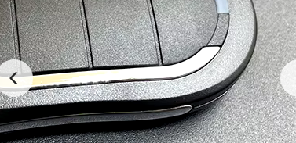

# ALUTECH AT-4N-868
Reversere engineer an 

## Hypotheis
* Can this radio protocoll be decoded i rtl_433 and is there any vulnerabilities 
* Create and Flex decoder ALUTECH-AT-4N-868.conf file 
* Create and C version 

## Reverse engineering
Universal radio Hacker (URH) recored and try to decode the data 

