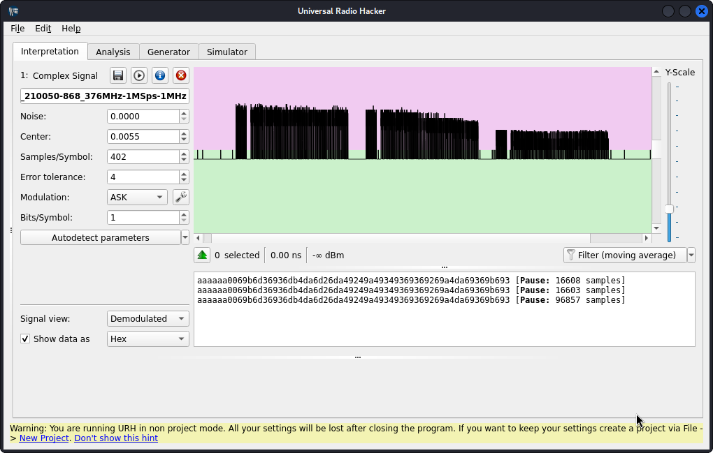

# ALUTECH AT-4N-868
Reversere engineer an garage door remote key fob 

 

## Hypotheis
* Can this radio protocoll be decoded in rtl_433 and is there any vulnerabilities 
* Create and Flex decoder alutech.conf file based on examples from [rtl_433 conf](https://github.com/merbanan/rtl_433/tree/master/conf)
* Create and C version and possible merge to [rtl_433 devices](https://github.com/merbanan/rtl_433/tree/master/src/devices)
* Is it possibe to open grage door with an flipper

## Datasheets 
| No       | Description | IC           |
| ---      | ---         |---           |
|        | Probably         | [Microchip HCS301](https://ww1.microchip.com/downloads/aemDocuments/documents/MCU08/ProductDocuments/DataSheets/21143C.pdf)  |

## Reverse engineering
Universal radio Hacker (URH) recored and try to decode the data from one [keypress](urh_alutech.complex16s) 
* It's 868,35MHz ASK alias OOK in URH 
* It's a rolling message, so a simple clone is not enough 
* There is an preaamble of 6 a in hex and the message is repeated 3 times for each keypres
* An Pause threshold of 10 under modulation is enough to get preable and message to be in one message
* Coverting from URH to RTL Flex decoder using this as [inspiration](https://github.com/klohner/klohner.github.io/blob/master/SDR/Decoding/Example_2019-01-24/README.md)  

